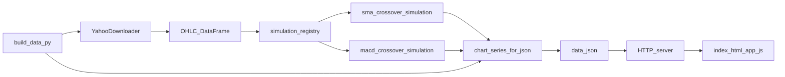

# Rule-strategy chart site (static)

Interactive charts use [Chart.js](https://www.chartjs.org/) (CDN) and load **`data.json`** produced by **`build_data.py`**.

The UI supports **multiple simulation models**: pick one from the dropdown, or enable **Compare all models** to overlay every strategy’s equity curve with buy-and-hold.

**SMA crossover vs MACD crossover are different rules** — equity curves **will not match**. **`shared.buy_hold_value`** is identical for both (same calendar and commissions); only **`portfolio_value`** differs per strategy.

## Data flow



1. **`build_data.py`** downloads daily bars via **`YahooDownloader`**.
2. **`simulation_registry.py`** maps strategy ids (`sma_crossover`, `macd_crossover`, …) to **`simulate_*`** functions.
3. Each simulation returns a DataFrame (close, overlays, **`portfolio_value`**, **`buy_hold_value`**).
4. **`chart_series_for_json.py`** converts overlays + equity series for JSON (`overlay_series` may split **price** vs **macd** panes).
5. **`data.json`** shape: **`meta`**, **`shared`** (labels, close, buy-and-hold), **`strategies`** (per-model overlays + **`portfolio_value`**).
6. **`app.js`** reads **`data.json`** (still accepts legacy single-**`chart`** files).

### Adding another model

1. Add **`web/my_strategy_simulation.py`** with **`simulate_my_strategy(raw_df, …)`**.
2. Register it in **`simulation_registry.py`** (`STRATEGIES`) with **`label`**, **`build_kwargs`** mapper, and **`chart_overlays`** (`None` for auto **`sma_*`**, or explicit **`column`/`label`/`chart`** entries).

## Contents

| File | Role |
|------|------|
| `index.html` | Shell + strategy toolbar |
| `app.js` | **`fetch`** **`data.json`**, selector + compare-all |
| `build_data.py` | CLI; **`--strategies`** comma list |
| `simulation_registry.py` | Lists registered strategies |
| `sma_crossover_simulation.py` | SMA crossover rule |
| `macd_crossover_simulation.py` | MACD line vs signal rule |
| `chart_series_for_json.py` | DataFrame → chart payload |
| `data.sample.json` | Minimal legacy shape reference |

## 1. Generate `data.json`

From the **repository root** (FinRL env activated):

```bash
python web/build_data.py
python web/build_data.py --strategies sma_crossover
python web/build_data.py --strategies sma_crossover,macd_crossover --macd-fast 12 --macd-slow 26 --macd-signal 9
```

Common flags: **`--ticker`**, **`--start`**, **`--end`**, **`--short`** / **`--long`** (SMA), **`--macd-fast`** / **`--macd-slow`** / **`--macd-signal`**, **`--output-dir`**, **`--png`**.

## 2. Serve over HTTP

```bash
cd web
python -m http.server 8765
```

Open **[http://localhost:8765](http://localhost:8765)** — optional deep link **`#strategy=sma_crossover`**.

## Notes

- **`results/`** at repo root is FinRL’s runtime output (`RESULTS_DIR`); not used by this site.
- **`data.json`** is gitignored.
- Chart.js loads from jsDelivr unless you vendor it under **`web/vendor/`**.
