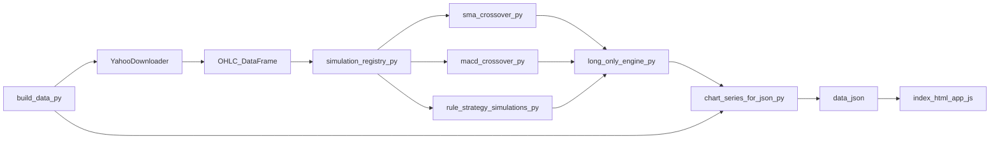

# Rule-strategy chart site (static)

Interactive charts use [Chart.js](https://www.chartjs.org/) (CDN) and load **`data.json`** produced by **`build_data.py`**.

Pick a strategy from the dropdown or enable **Compare all models** to overlay equity curves. **`shared.buy_hold_value`** is the same for every strategy on the same history; **`portfolio_value`** differs by rule.

**SMA crossover vs MACD crossover are different rules** — equity curves **will not match**. Buy-and-hold is identical for the same calendar and commissions.

## Built-in strategies (`simulations/simulation_registry.py`)

| Id                   | Rule (long-only, simplified)                                         |
| -------------------- | -------------------------------------------------------------------- |
| `sma_crossover`      | Short SMA > long SMA → invested                                      |
| `macd_crossover`     | MACD line > signal → invested                                        |
| `rsi_mr`             | Cross up through RSI low → enter; cross down through RSI high → exit |
| `bollinger_mr`       | Close ≤ lower band → enter; close ≥ middle band → exit               |
| `bollinger_breakout` | Close > upper band → enter; close < middle band → exit               |
| `adx_di_trend`       | ADX > threshold and +DI > −DI → invested                             |
| `donchian_breakout`  | Close > prior N-bar high → enter; close < prior N-bar low → exit     |
| `zscore_mr`          | Z-score < −entry → enter; Z-score > exit → flat                      |
| `obv_ma_cross`       | OBV > SMA(OBV) and close > SMA(close) → invested                     |

Indicators that do not share price scale use the **Indicators** panel (`chart: "indicator"` in registry); Bollinger and Donchian bands plot on **price**.

## Folder layout

```
web/
  simulations/
    __init__.py
    simulation_registry.py
    data_prep.py
    long_only_engine.py
    technicals.py
    sma_crossover_simulation.py
    macd_crossover_simulation.py
    rule_strategy_simulations.py
  build_data.py
  chart_series_for_json.py
  index.html
  app.js
  ...
```

## Data flow



1. **`build_data.py`** downloads daily bars via **`YahooDownloader`**.
2. **`simulation_registry.py`** maps strategy ids to **`simulate_*`** functions.
3. Each simulation returns a DataFrame (close, overlays, **`portfolio_value`**, **`buy_hold_value`**).
4. **`chart_series_for_json.py`** builds **`overlay_series`** (price vs indicator/`macd` panes).
5. **`data.json`**: **`meta`**, **`shared`** (labels, close, buy-and-hold), **`strategies`** (overlays + **`portfolio_value`** per model).
6. **`app.js`** reads **`data.json`** (still accepts legacy single-**`chart`** payloads).

## Contents (web root vs `simulations/`)

| Path                                       | Role                                                  |
| ------------------------------------------ | ----------------------------------------------------- |
| `index.html`                               | Shell + strategy toolbar                              |
| `app.js`                                   | Fetch **`data.json`**, selector + compare-all + zoom   |
| `build_data.py`                            | CLI; **`--strategies`** + indicator params            |
| `chart_series_for_json.py`                 | DataFrame → JSON (**`overlay_series`**)               |
| `simulations/__init__.py`                  | Package exports                                       |
| `simulations/simulation_registry.py`       | **`STRATEGIES`** + **`default_build_kwargs`**          |
| `simulations/data_prep.py`                 | Shared OHLCV normalization                            |
| `simulations/long_only_engine.py`          | Signal → **`portfolio_value`** / **`buy_hold_value`** |
| `simulations/technicals.py`                | RSI, BB, ADX/DI, Donchian, OBV, z-score               |
| `simulations/rule_strategy_simulations.py` | RSI / BB / ADX / Donchian / z-score / OBV rules       |
| `simulations/sma_crossover_simulation.py`  | SMA crossover                                         |
| `simulations/macd_crossover_simulation.py` | MACD crossover                                        |
| `data.sample.json`                         | Example **`shared`** + **`strategies`** shape         |

### Adding a strategy

Implement **`simulate_*`** under **`web/simulations/`**, register in **`simulation_registry.py`** (`label`, `build_kwargs`, `chart_overlays`), and extend **`default_build_kwargs`** / **`build_data.py`** CLI if new parameters are needed.

## Generate `data.json`

From **repository root** (FinRL env):

```bash
python web/build_data.py
python web/build_data.py --strategies sma_crossover,rsi_mr,macd_crossover
python web/build_data.py --strategies sma_crossover,macd_crossover --png
```

Common flags: **`--ticker`**, **`--start`**, **`--end`**, SMA (**`--short`** / **`--long`**), MACD (**`--macd-fast`** / **`--macd-slow`** / **`--macd-signal`**), **`--output-dir`**, **`--png`**.

**Default history:** **`--start 2023-01-01`** through **`--end` today** (local date).

If the chart looks **too short**, **`web/data.json`** was built with a short window — rerun with your range.

If the UI only shows **two** strategies, **`data.json`** is stale — regenerate without **`--strategies`** for all nine models.

**Import note:** `build_data.py` puts **`web/`** first on **`sys.path`** so **`web/simulations/`** is never shadowed by another **`simulations`** package at the repo root.

## Serve over HTTP

```bash
cd web
python -m http.server 8765
```

Open **[http://localhost:8765](http://localhost:8765)** (`#strategy=sma_crossover` optional).

## Notes

- **Zoom / pan:** Wheel zooms along the **time (x) axis**; drag to pan. Use **Reset zoom** per chart. Scripts: Chart.js, Hammer.js, `chartjs-plugin-zoom` (CDN).
- **`results/`** at repo root is FinRL’s runtime output; not used by this site.
- **`data.json`** is gitignored.
- Chart.js loads from jsDelivr unless vendored under **`web/vendor/`**.
